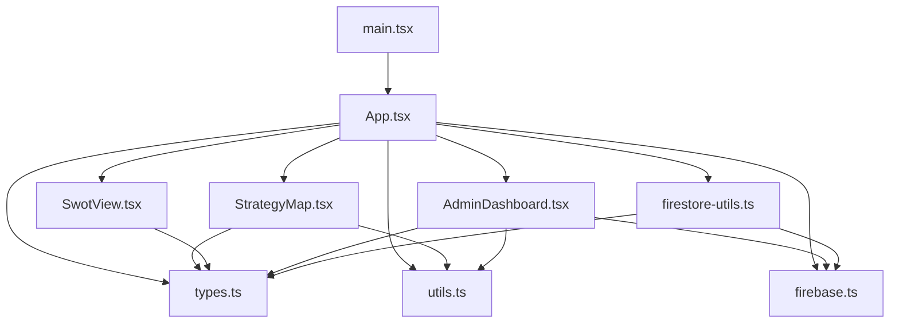
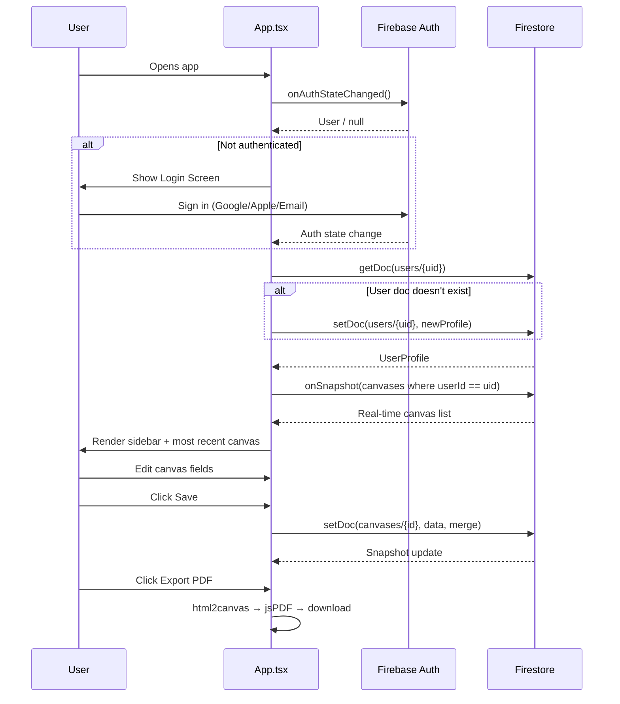

# Strategy Labs — Design Document

> **Last Updated:** 2 May 2026
> **Author:** Antigravity (AI review)
> **Repo:** `davidyoungrs/strategymapweb`

---

## 1. Product Overview

**Strategy Labs** is a web-based strategic planning tool that lets users build, edit, save, and export three interconnected frameworks:

| Framework | Purpose |
|---|---|
| **Business Model Canvas (BMC)** | Osterwalder's 9-block canvas for mapping a business model |
| **Strategy Map** | Balanced Scorecard style — objectives across Financial → Customer → Internal → Learning & Growth |
| **SWOT Analysis** | 2×2 grid of Strengths, Weaknesses, Opportunities, Threats |

All three tools share a **single unified project** (called a "Canvas" in code). Switching between views (BMC, Strategy Map, SWOT) operates on the same data record.

---

## 2. Tech Stack

| Layer | Technology |
|---|---|
| **Frontend** | React 19 + TypeScript, Vite 6, TailwindCSS v4 |
| **Styling** | Tailwind v4 via `@tailwindcss/vite` plugin, `tailwind-merge` + `clsx` utility |
| **Icons** | Lucide React |
| **Animation** | Motion (Framer Motion successor) — imported but not heavily used yet |
| **Auth** | Firebase Auth (Google, Apple, Email/Password) |
| **Database** | Cloud Firestore (custom database ID, not `(default)`) |
| **PDF Export** | `html2canvas` + `jsPDF` |
| **AI (planned)** | `@google/genai` package installed (Gemini API key wired via `process.env.GEMINI_API_KEY`) — **not yet used in code** |
| **Deployment** | Vercel (SPA rewrite config present), GitHub push flow |

---

## 3. Project Structure

```
strategy-labs/
├── index.html                 # SPA entry point
├── package.json               # Dependencies & scripts
├── vite.config.ts             # Vite + TailwindCSS v4 + React plugins
├── tsconfig.json              # TypeScript config (ES2022, bundler resolution)
├── vercel.json                # SPA catch-all rewrite
├── firebase-applet-config.json # Firebase project config (fallback for env vars)
├── firebase-blueprint.json    # Firestore schema documentation
├── firestore.rules            # Security rules
├── metadata.json              # App metadata (name, description)
├── .env.example               # Required environment variables
└── src/
    ├── main.tsx               # React entry — renders <App />
    ├── App.tsx                # ★ Monolithic main component (~1300 lines)
    ├── index.css              # Tailwind import + dark mode variant
    ├── firebase.ts            # Firebase init, auth exports
    ├── types.ts               # TypeScript interfaces & enums
    ├── vite-env.d.ts          # Vite type declarations
    ├── components/
    │   ├── StrategyMap.tsx     # Balanced Scorecard strategy map view
    │   ├── SwotView.tsx        # SWOT analysis 2×2 grid
    │   └── AdminDashboard.tsx  # Admin-only user/canvas overview
    └── lib/
        ├── firestore-utils.ts  # Firestore error handling with auth context
        └── utils.ts            # cn() utility (clsx + twMerge)
```

---

## 4. Data Model (Firestore)

### 4.1 `users/{userId}` — UserProfile

| Field | Type | Required | Notes |
|---|---|---|---|
| `uid` | string | ✅ | Immutable, matches Auth UID |
| `email` | string | ✅ | Validated format |
| `displayName` | string | ❌ | Max 100 chars |
| `photoURL` | string | ❌ | Max 1000 chars |
| `isPaidTier` | boolean | ✅ | Set to `false` on creation; upgradeable |
| `role` | `"admin" \| "user"` | ❌ | Admin check also uses hardcoded email |

### 4.2 `canvases/{canvasId}` — CanvasData

| Field | Type | Required | Notes |
|---|---|---|---|
| `userId` | string | ✅ | Immutable, owner reference |
| `title` | string | ✅ | 1–200 chars |
| `keyPartners` | string | ✅ | BMC block (up to 20K chars each) |
| `keyActivities` | string | ✅ | |
| `valuePropositions` | string | ✅ | |
| `customerRelationships` | string | ✅ | |
| `customerSegments` | string | ✅ | |
| `keyResources` | string | ✅ | |
| `channels` | string | ✅ | |
| `costStructure` | string | ✅ | |
| `revenueStreams` | string | ✅ | |
| `strategyMap` | map | ❌ | `{ financial: [], customer: [], internal: [], learning: [] }` |
| `swot` | map | ❌ | `{ strengths, weaknesses, opportunities, threats }` (strings) |
| `createdAt` | timestamp | ✅ | Immutable after creation |
| `updatedAt` | timestamp | ✅ | Server timestamp on every save |
| `imageUrl` | string | ❌ | Not currently used in UI |
| `logoUrl` | string | ❌ | Base64 data URL or external URL |

---

## 5. Authentication Flow

```
┌─────────────────────────┐
│      Login Screen       │
│                         │
│  ┌─ Google OAuth ─────┐ │
│  ├─ Apple OAuth ──────┤ │
│  └─ Email/Password ───┘ │
│                         │
│  (3 modes: oauth /      │
│   signin / signup)      │
└────────┬────────────────┘
         │
         ▼
   onAuthStateChanged
         │
         ├─ User exists in Firestore? → Load profile
         └─ New user? → Create profile doc (isPaidTier = false)
                        Admin email auto-gets isPaidTier = true
         │
         ▼
   Load user's canvases (real-time onSnapshot listener)
   → Most recently updated canvas is auto-loaded
```

**Auth providers configured:**
- Google (`GoogleAuthProvider`)
- Apple (`OAuthProvider('apple.com')`)
- Email/Password (with optional display name on signup)

---

## 6. Feature Breakdown

### 6.1 Business Model Canvas (Main View)
- 10-column × 3-row CSS Grid layout matching the Osterwalder BMC structure
- Each cell has an icon, label, and a `<textarea>` for free-form text
- Value Propositions cell is visually emphasised (bolder text)
- Optional company logo display (top-right of canvas)
- 10 pre-built templates (Nespresso, Hilti, Spotify, Amazon, etc.)

### 6.2 Strategy Map
- 4 perspective rows: Financial, Customer, Internal Process, Learning & Growth
- Each row holds editable "objective" cards (add/edit/remove)
- Directional arrows between rows indicate causal flow
- Inline project switcher (hidden dropdown in title area)

### 6.3 SWOT Analysis
- 2×2 grid with colour-coded quadrants (Emerald, Amber, Blue, Red)
- Each quadrant is a free-text `<textarea>`
- Labels indicate Internal/External and Positive/Negative axes

### 6.4 Project Management
- Sidebar lists all saved plans (real-time Firestore subscription)
- Create new canvas, load existing, delete with confirmation modal
- "Save As" behaviour: changing the title and saving creates a new document
- Canvases ordered by `updatedAt` descending

### 6.5 PDF Export
- `html2canvas` renders the canvas area at 2× scale
- `jsPDF` generates a single-page PDF matching the canvas dimensions
- Respects dark mode background colour
- **Pro-only feature** (gated behind `isPaidTier`)

### 6.6 Logo Management
- Modal with 3 input methods: file upload, drag & drop, URL paste
- Uploaded images are compressed to 400×400 max, JPEG 0.7 quality
- Stored as base64 data URL in the `logoUrl` field (or external URL)

### 6.7 Admin Dashboard
- Route: `/admin` (URL-based routing check in state initialiser)
- Access restricted to `david.young@reallysimpleapps.com`
- Lists all users with tier badges (Free / Premium)
- Expandable rows showing each user's canvases with tool-usage badges
- Read-only overview — no CRUD operations on other users' data

### 6.8 Monetisation / Tier System
- **Free tier:** Can use the BMC, Strategy Map, and SWOT in-session (no save/export)
- **Pro tier:** Save canvases to Firestore, export to PDF
- Upgrade flow: Currently a direct Firestore write (`isPaidTier = true`) — **no payment integration yet**
- Sidebar shows upgrade CTA for free users

### 6.9 Dark Mode
- Toggle in header bar (Sun/Moon icons)
- Persisted in `localStorage`
- Defaults to system preference (`prefers-color-scheme`)
- Applied via `.dark` class on `<html>` element (Tailwind v4 custom variant)

---

## 7. Security Rules Summary

| Collection | Read | Create | Update | Delete |
|---|---|---|---|---|
| `users` | Owner or Admin | Owner only (isPaidTier must be false) | Owner only (uid immutable) | ❌ Not allowed |
| `canvases` | Owner or Admin | Auth + Valid + **Pro only** | Owner + Valid + userId/createdAt immutable + **Pro only** | Owner only |

Key security design decisions:
- Admin is determined by **both** Firestore `role` field and hardcoded email check
- Canvas CRUD requires Pro tier (via `isPro()` helper that reads user doc)
- Full field validation in rules (type checking, length limits, allowed fields whitelist)

---

## 8. Architectural Observations & Improvement Areas

### 8.1 Code Organisation
> [!IMPORTANT]
> `App.tsx` is a **1,297-line monolith** containing auth logic, state management, event handlers, templates data, and all UI rendering. This is the single biggest technical debt item.

**Suggested decomposition:**
- `hooks/useAuth.ts` — Auth state, login/logout handlers
- `hooks/useCanvas.ts` — Canvas CRUD, Firestore listeners
- `components/Sidebar.tsx` — Navigation sidebar
- `components/Header.tsx` — Top toolbar
- `components/LoginScreen.tsx` — Auth UI
- `components/CanvasGrid.tsx` — BMC grid layout
- `components/LogoModal.tsx` — Logo upload modal
- `components/DeleteModal.tsx` — Confirmation dialog
- `data/templates.ts` — Template data constants

### 8.2 Routing
- Currently using `window.location.pathname` check + manual `window.history.pushState` for admin route
- `react-router-dom` v7 is installed but **completely unused**
- Should implement proper declarative routing

### 8.3 State Management
- All state lives in `App.tsx` via 15+ `useState` hooks
- No context providers, no state library
- Complex prop drilling to child components (e.g., `userCanvases`, `onSelectCanvas`)
- Consider React Context or a lightweight store for shared state

### 8.4 Unused Dependencies
| Package | Status |
|---|---|
| `@google/genai` | Installed, Gemini API key wired in Vite config, but **zero usage in source** |
| `motion` (Framer Motion) | Installed but **no motion components used** |
| `react-router-dom` | Installed but **not imported anywhere** |
| `dotenv` | In dependencies but env vars are handled by Vite natively |
| `express` | In dependencies — appears unused (no server code) |

### 8.5 UI/UX Gaps
- **No mobile/responsive layout** — sidebar is fixed 288px width, canvas grid is 10-column, no breakpoint handling
- Header nav items ("Models", "Team") are **dead links** (`href="#"`)
- "Help" button in sidebar has **no functionality**
- No loading/error toasts — errors use `alert()` and `console.error`
- No undo/redo capability
- No autosave functionality
- Title input for the canvas uses the page title on the current view (e.g. "Architectural Canvas") which doesn't match the actual view when on Strategy Map or SWOT

### 8.6 Data / Storage Concerns
- Logos stored as base64 in Firestore documents → large document sizes, potential 1MB doc limit issues
- No Firebase Storage integration for file uploads
- `imageUrl` field exists in schema but is never populated or used
- SWOT title field is in the `SwotData` type but not in the Firestore schema validation

### 8.7 Security Considerations
- Firebase config (API key, project ID) is committed in `firebase-applet-config.json` — these are client-safe but the file also serves as a fallback when env vars aren't set
- Admin check uses a **hardcoded email string** in both client code and Firestore rules
- Upgrade to Pro is a **client-side Firestore write** — any authenticated user could bypass the upgrade gate by writing directly to their user doc
- No rate limiting on canvas creation

### 8.8 Build & Deployment
- `index.html` title says "My Google AI Studio App" — should be "Strategy Labs"
- No favicon configured
- No meta description or OG tags
- Vercel config is minimal (SPA rewrite only)

---

## 9. Component Dependency Map



---

## 10. Data Flow



---

## 11. Template Library

The app ships with **10 pre-built BMC templates** for learning and quick-start:

1. Nespresso (B2C Premium)
2. Hilti (Product-to-Service)
3. Spotify (Freemium)
4. Automobile Company
5. Amazon
6. Patagonia
7. Carvana
8. Udemy
9. AliExpress
10. Cainiao

Templates populate BMC fields only (not Strategy Map or SWOT).

---

## 12. Summary

Strategy Labs is a well-structured proof-of-concept strategic planning SPA with solid Firestore security rules and a clean visual design. The core functionality — BMC editing, Strategy Maps, SWOT, save/load/export — works end-to-end. The primary areas for improvement are:

1. **Decompose `App.tsx`** from a 1,300-line monolith into focused components and hooks
2. **Wire up `react-router-dom`** for proper routing (it's already installed)
3. **Integrate or remove unused packages** (`@google/genai`, `motion`, `express`, `dotenv`)
4. **Add responsive/mobile support** — the current layout breaks below ~1200px
5. **Secure the upgrade flow** — move `isPaidTier` writes to a server-side function
6. **Move logo storage** from base64-in-Firestore to Firebase Storage
7. **Add proper error handling** — replace `alert()` calls with toast notifications
8. **Fix `index.html` metadata** — title, favicon, meta tags
